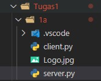
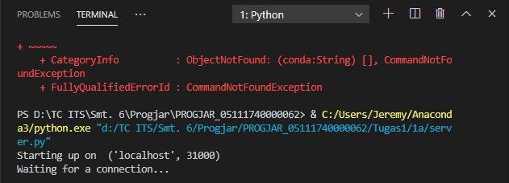
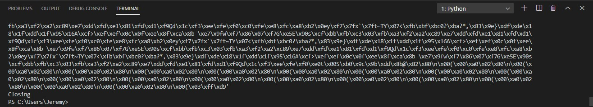
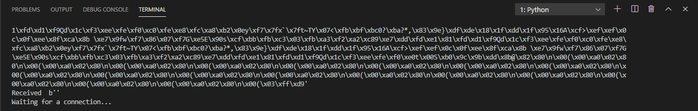
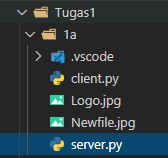

# Tugas 1a
### Mengirimkan file dari client ke server

#### Kondisi awal sebelum file terkirim

#### Menjalankan file server untuk menerima file pada port 31000

#### Client mengirimkan file ke server dengan nama baru melalui port 31000

#### Server masih dalam keadaan terbuka koneksinya dan menunggu file lain

#### Kondisi setelah file terkirim

