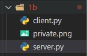
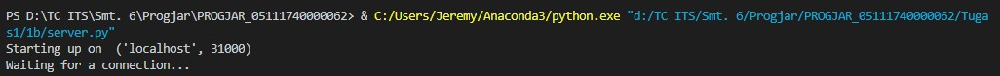
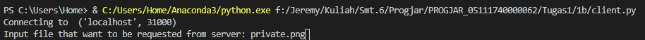
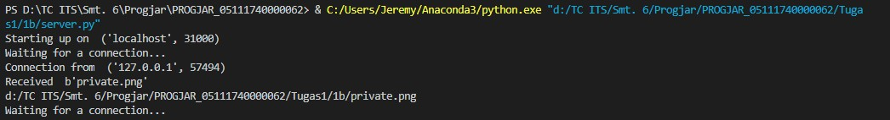
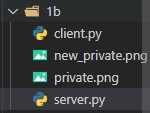

# Tugas 1b
### Meminta file dari server dengan memasukkan nama file yang ingin dikirim pada client

#### Keadaan awal sebelum file dikirim

#### Menjalankan file server pada port 31000

#### Menjalankan file client dan memasukkan nama file yang ingin dikirim oleh server

#### Server selesai mengirimkan file

#### Keadaan setelah file terkirim dengan nama baru

