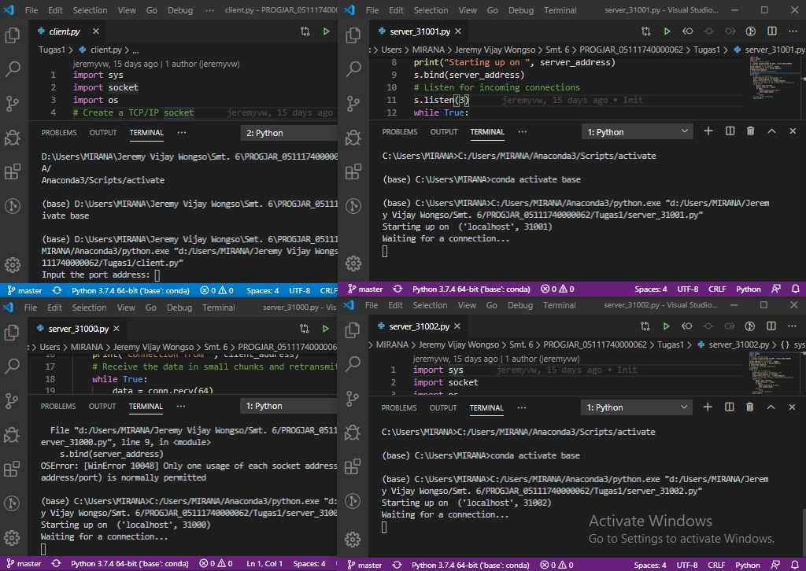
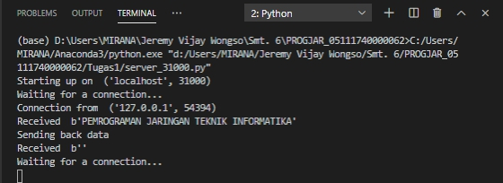
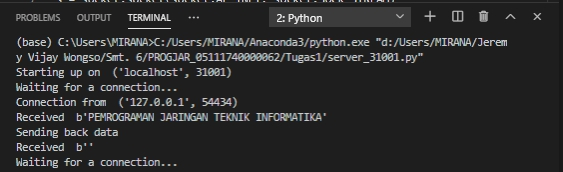
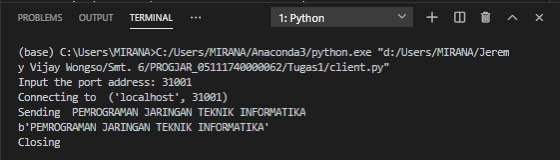
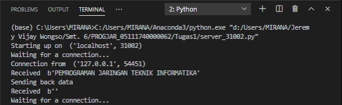
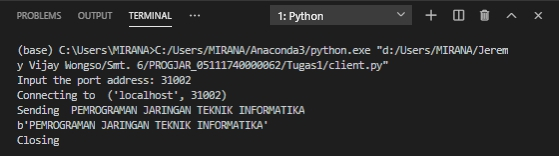

# Tugas 1
### Menyiapkan ketiga server port 31000, 31001, 31002

#### Kondisi Awal Server dan Client

#### Client mengirimkan pesan ke server port 31000

#### Client mengirimkan pesan ke server port 31001

#### Client mengirimkan pesan ke server port 31002

