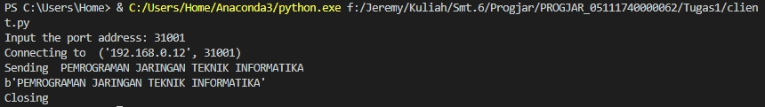
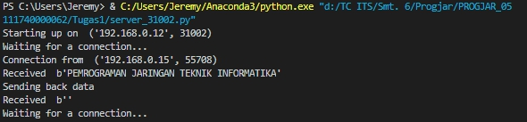

# Tugas 1
### Menyiapkan ketiga server port 31000, 31001, 31002

## Pada PC yang sama
#### Kondisi Awal Server dan Client

#### Client mengirimkan pesan ke server port 31000

#### Client mengirimkan pesan ke server port 31001

#### Client mengirimkan pesan ke server port 31002

## Pada PC yang berbeda
### Jalankan program server.py di 3 port yang berbeda di 2 komputer yang berbeda

#### Server dijalankan pada 192.168.0.15

#### Server dijalankan pada 192.168.0.12

### Jalankan program client.py untuk konek ke server pada poin sebelumnya, kirimkan string yang sama

#### Client dari 192.168.0.15 connect ke 192.0.168.12 

#### Server dari 192.168.0.12 menerima koneksi dari 192.168.0.15

#### Client dari 192.168.0.12 connect ke 192.0.168.15 

#### Server dari 192.168.0.15 menerima koneksi dari 192.168.0.12

