# Tugas 10

#### Menjalankan Asynchronous Server pada Port 9002, 9003, 9004, 9005

#### Menjalankan Load Balancer pada port 44444

#### Membuka browser pada http://localhost:44444/page.html

#### Bisa dilihat pada log program, setiap request akan dilayani oleh backend yang bergantian

## Stress Benchmark Asynchronous Server + Load Balancer Table

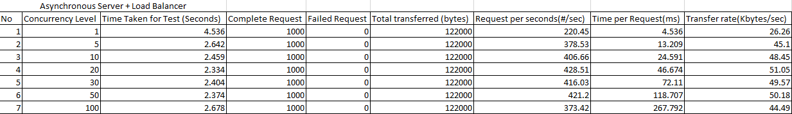

## Stress Benchmark Server Thread Table

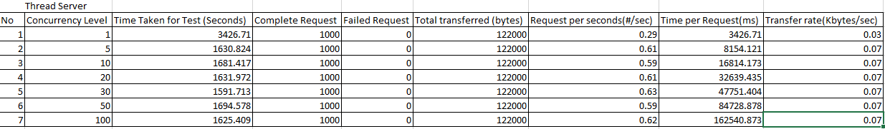

## Stress Benchmark Asynchronous Server + Load Balancer

#### Concurrency 1

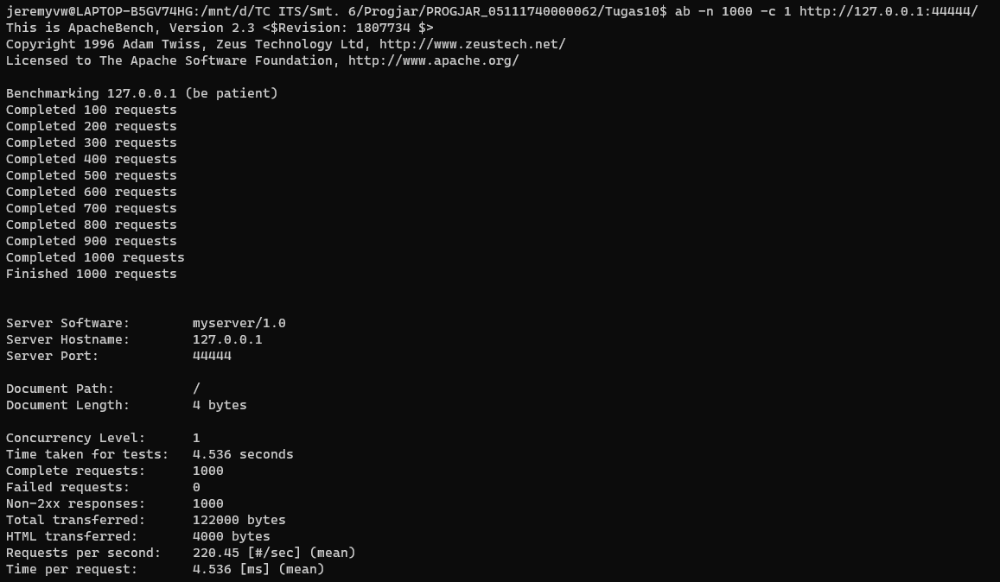
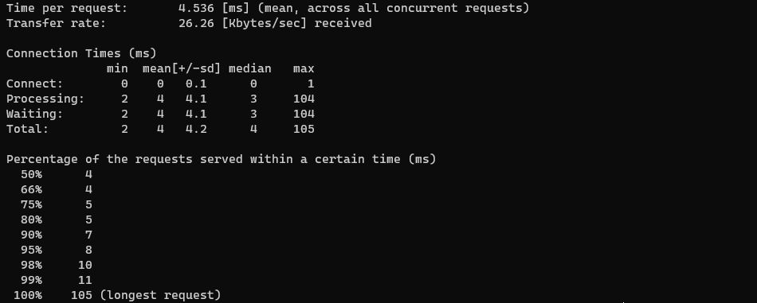

#### Concurrency 5

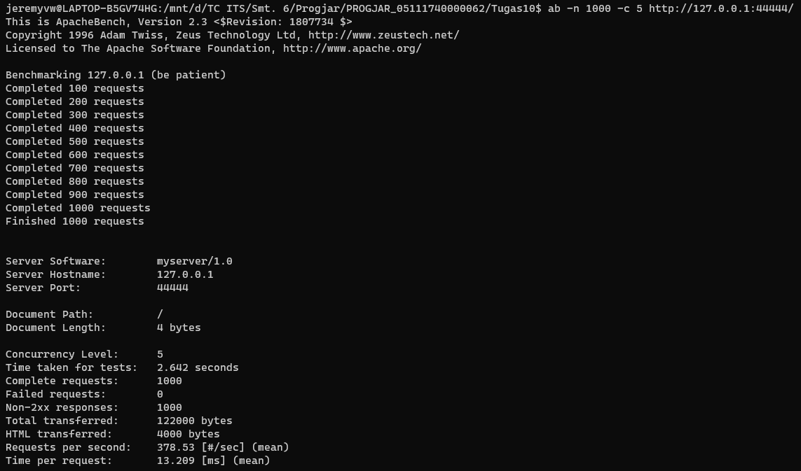
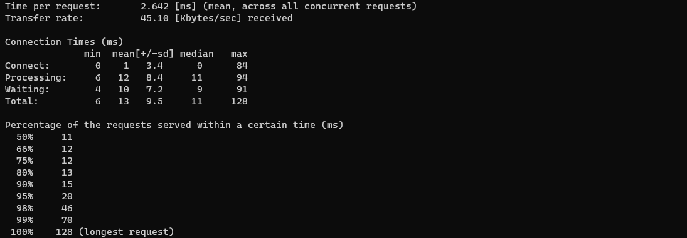

#### Concurrency 10

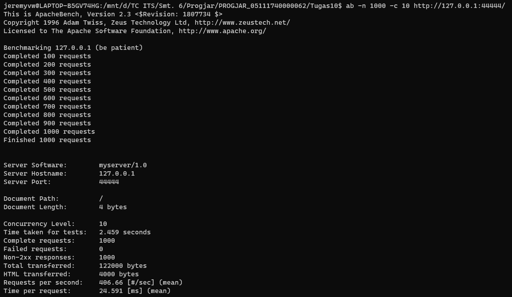
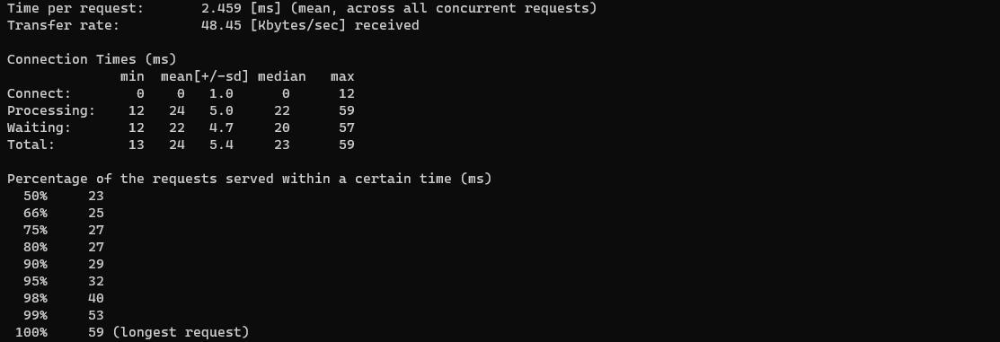

#### Concurrency 20

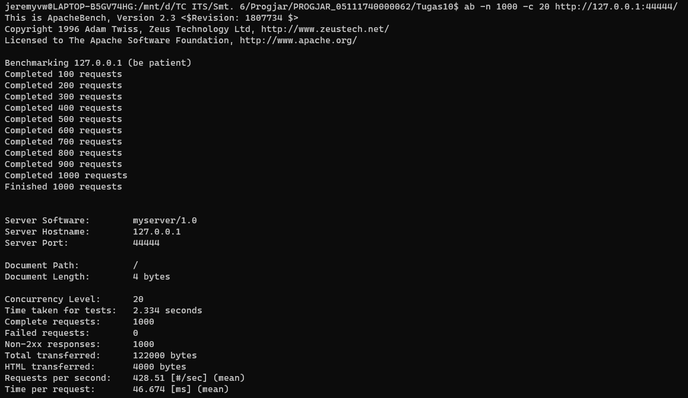
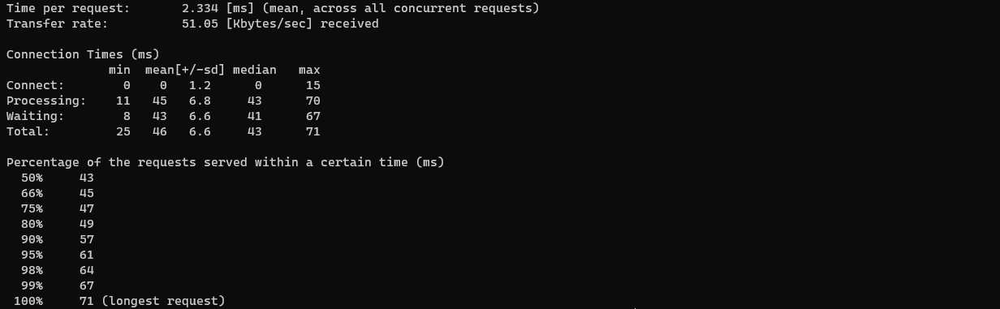

#### Concurrency 30

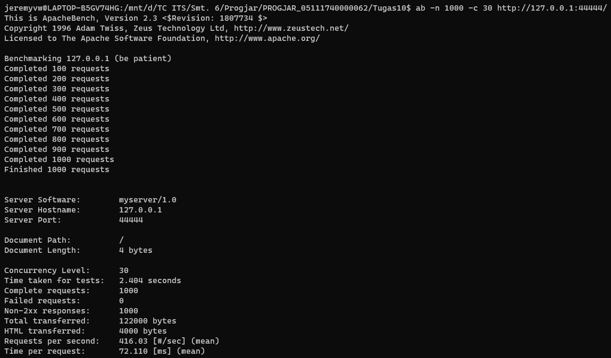
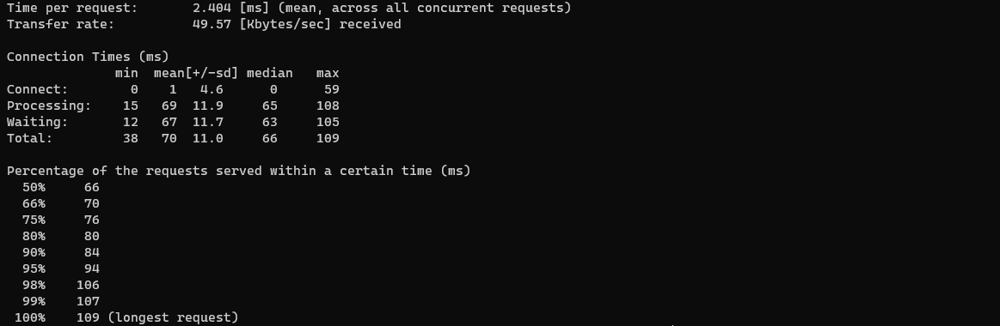

#### Concurrency 50

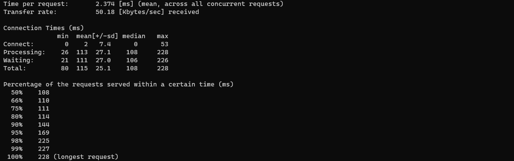

#### Concurrency 100

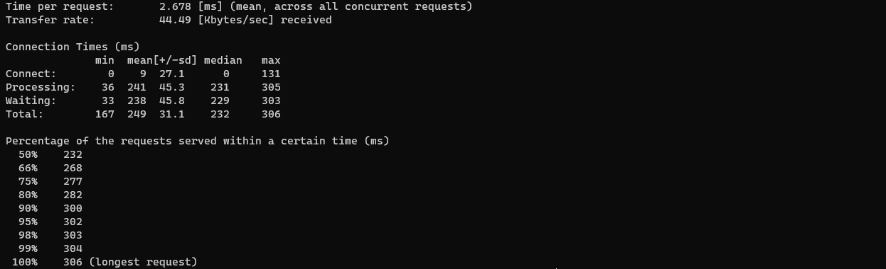

## Stress Benchmark Thread Server

#### Concurrency 1

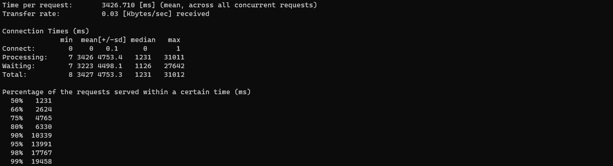

#### Concurrency 5

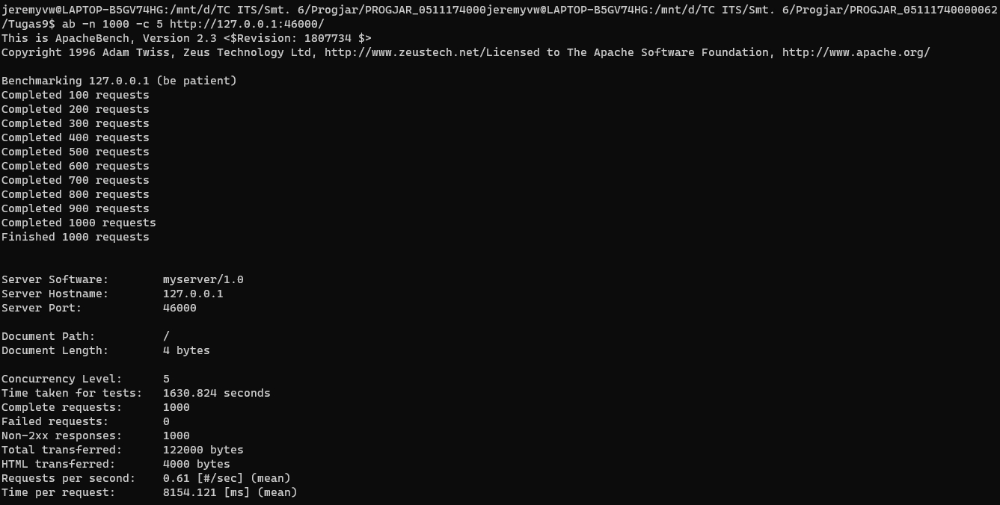
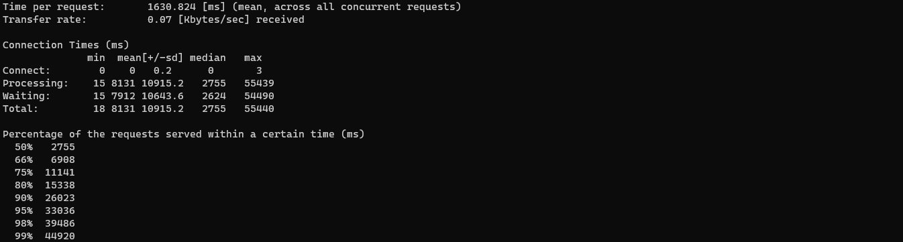

#### Concurrency 10

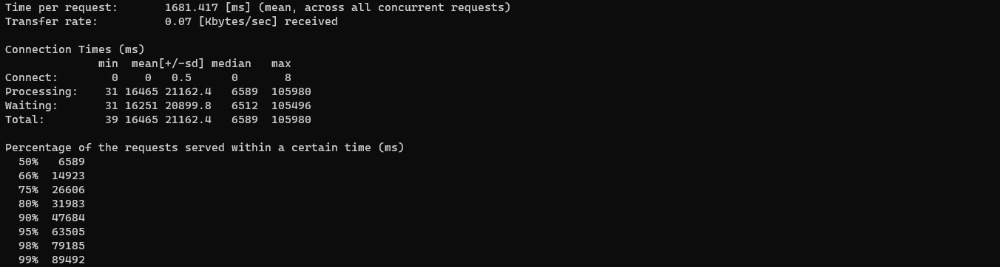

#### Concurrency 20

#### Concurrency 30

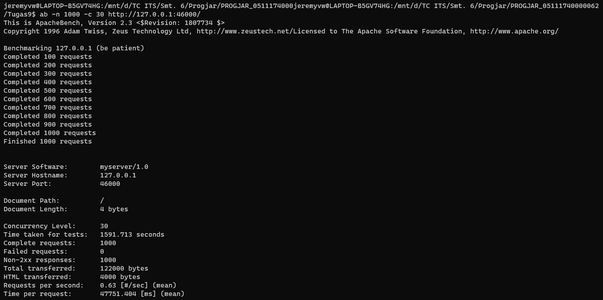
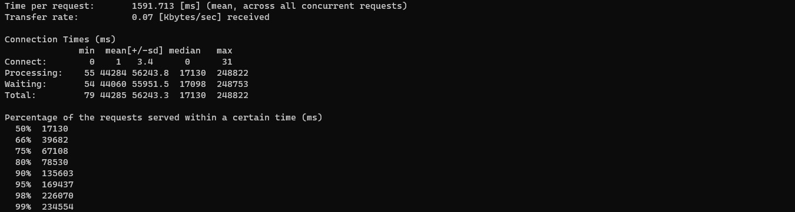

#### Concurrency 50

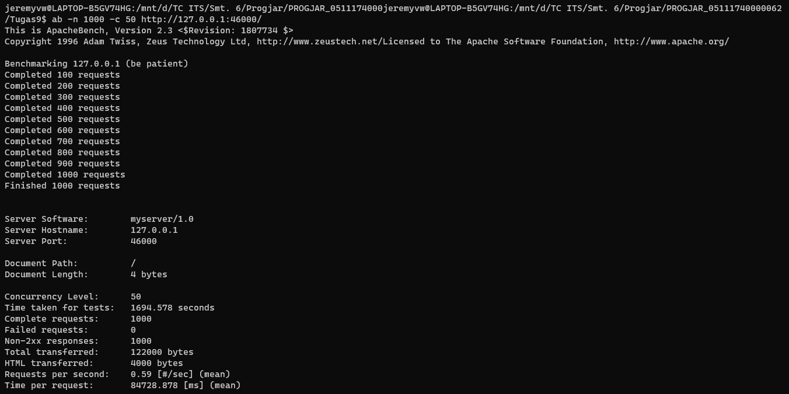
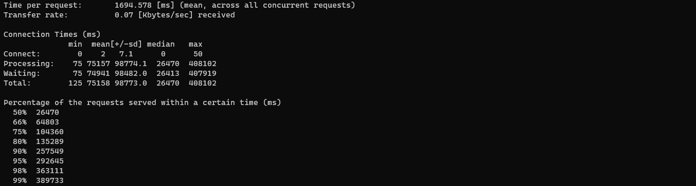

#### Concurrency 100

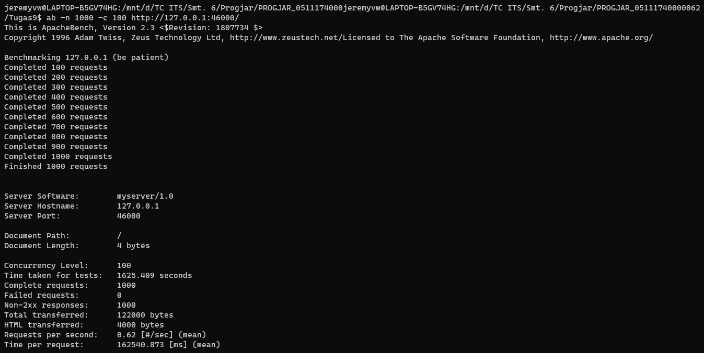
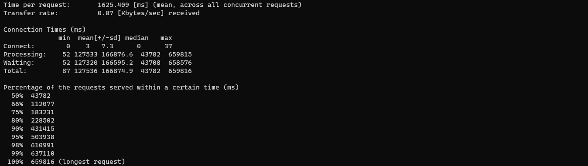