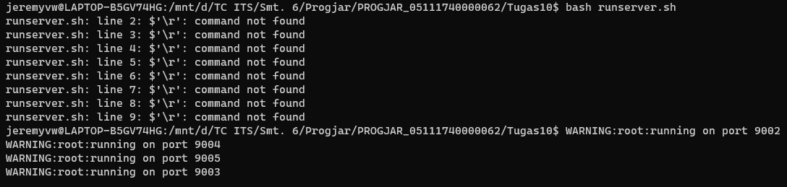
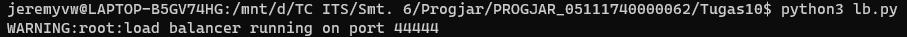
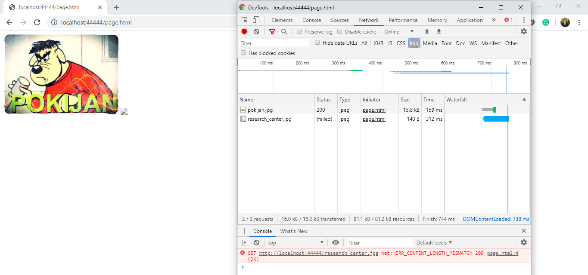
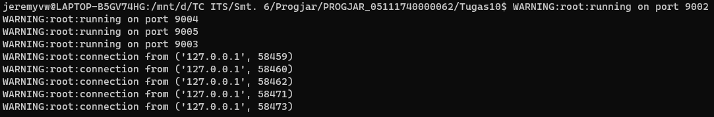
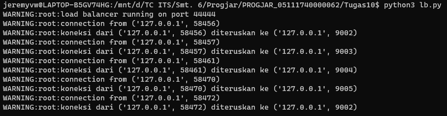

# Tugas 10

#### Menjalankan Asynchronous Server pada Port 9002, 9003, 9004, 9005

#### Menjalankan Load Balancer pada port 44444

#### Membuka browser pada http://localhost:44444/page.html

#### Bisa dilihat pada log program, setiap request akan dilayani oleh backend yang bergantian

