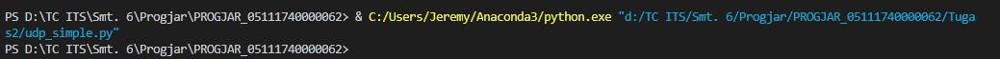
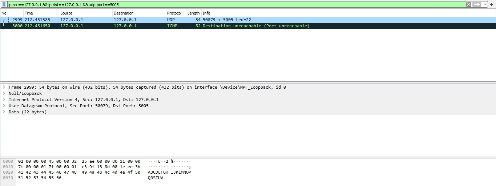
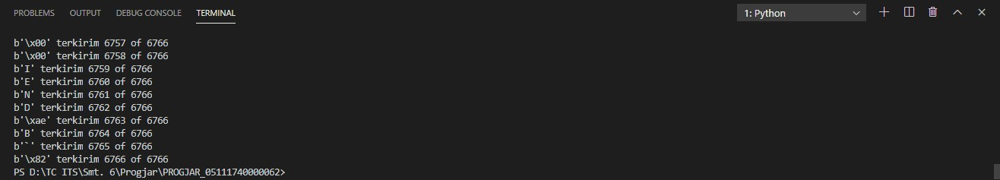
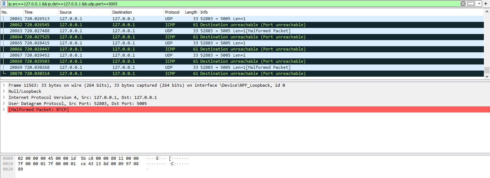
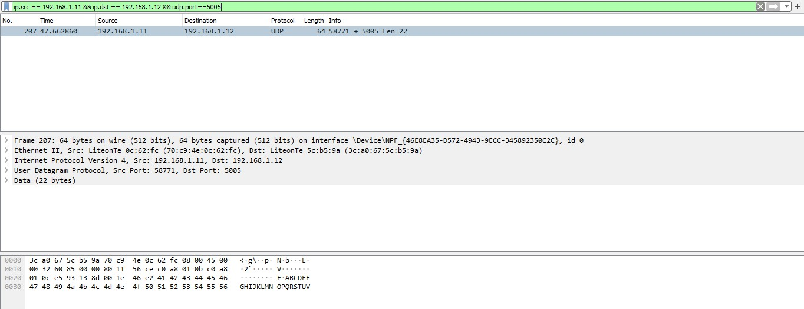
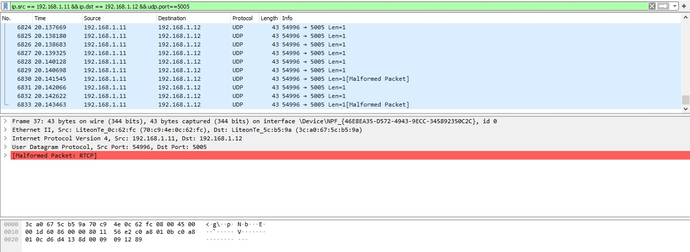

# Tugas 2

### Sniffing Packet Pada Localhost
#### Menjalankan udpsimple ke PC sendiri

#### Menjalankan udpfileclient ke PC sendiri

#### Menjalankan udpsimple dan arahkan alamat ke PC lain

#### Menjalankan udpfileclient dan arahkan alamat ke PC lain

