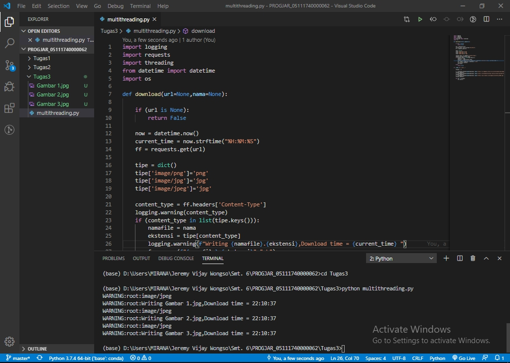

# Menjalankan Tugas 3
#### 1. Pindah direktori ke direktori program yang ingin di jalankan
#### 2. Jalankan program

## Hasil gambar yang telah terdownload menggunakan program multithread
### Gambar 1 

### Gambar 2

### Gambar 3
