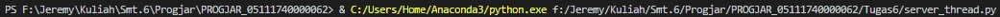
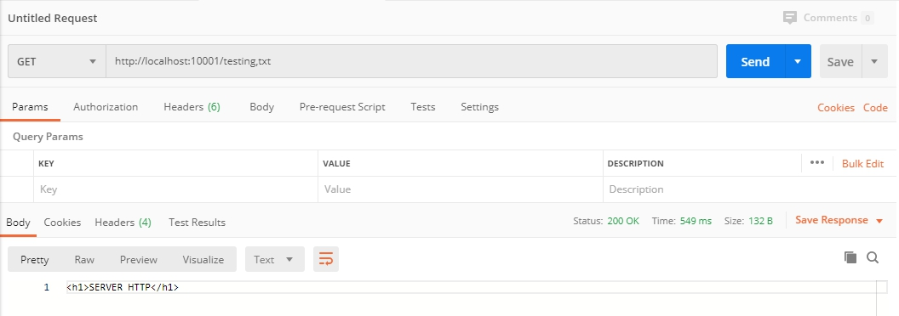
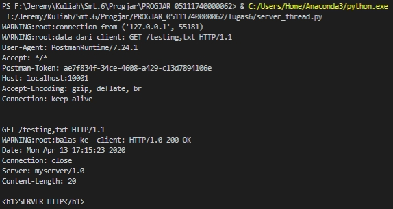
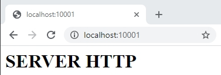
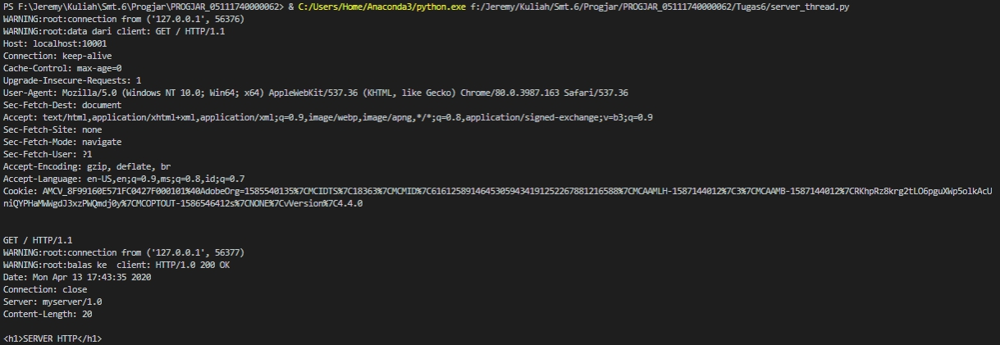
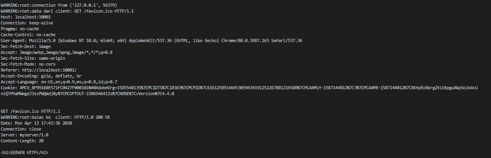
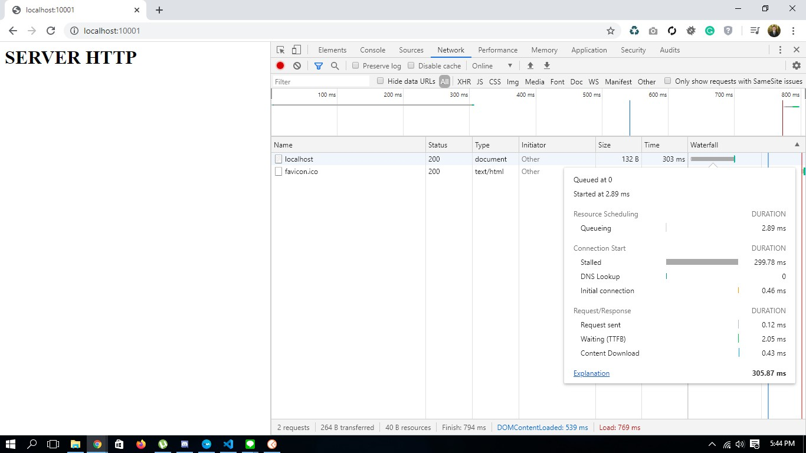

# Tugas 6

## Jalankan server_thread.py pada port 10001 di ip address 127.0.0.1

## Mencoba melakukan request dari _*Postman*_

## Balasan dari server

## Mencoba melakukan request dari browser

## Balasan dari server

## Browser pada tampilan _Developer Mode_

