# Tugas 7

## Hasil test apache-benchmark 10 request

### Concurrency 1

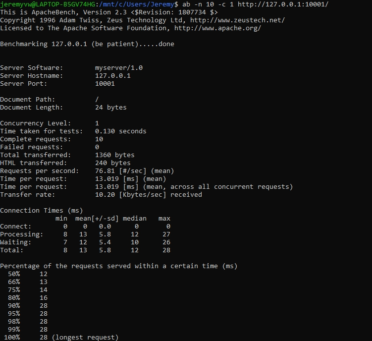

### Concurrency 5

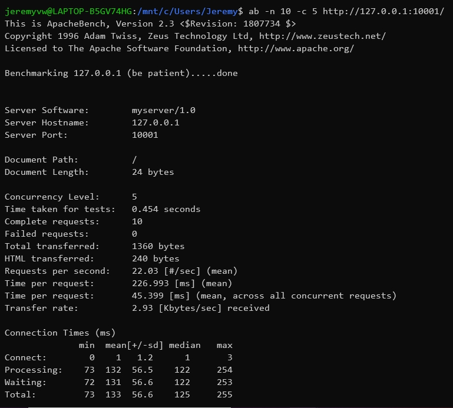

### Concurrency 10

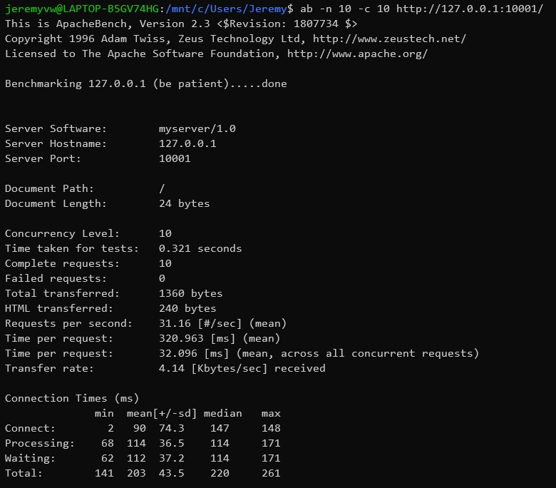
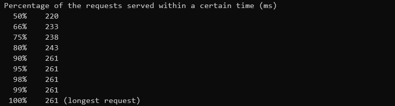

## Hasil test apache-benchmark 50 request

### Concurrency 1

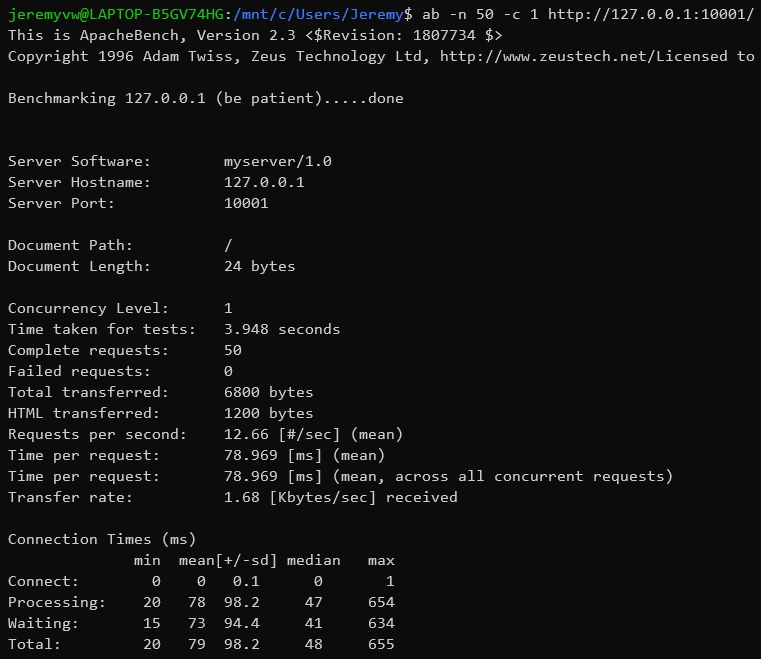
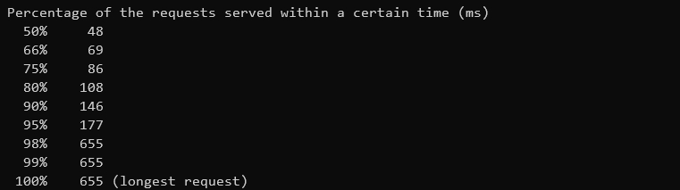

### Concurrency 10

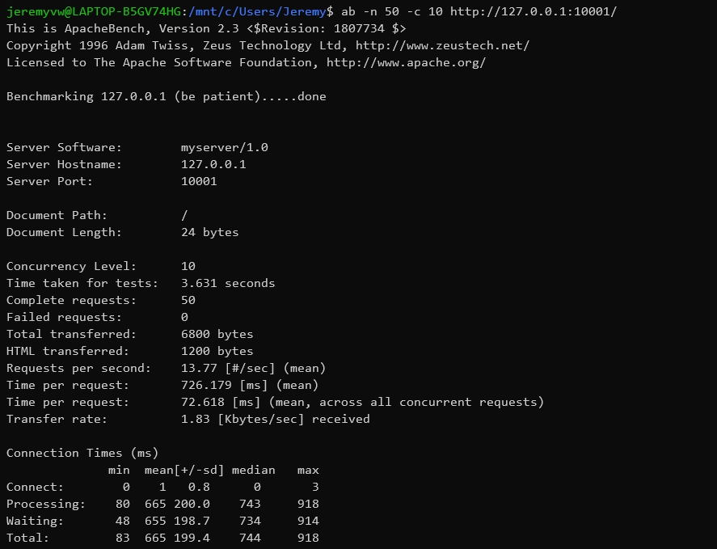
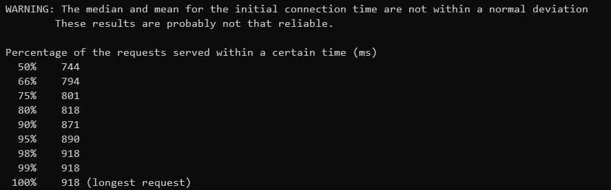

### Concurrency 30

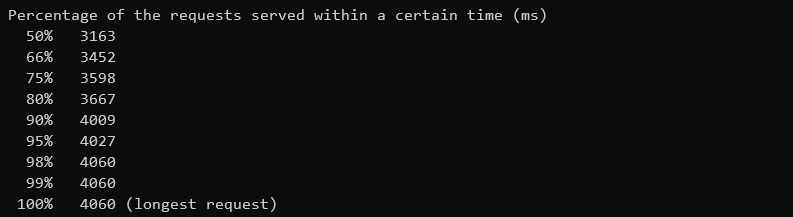

### Concurrency 50

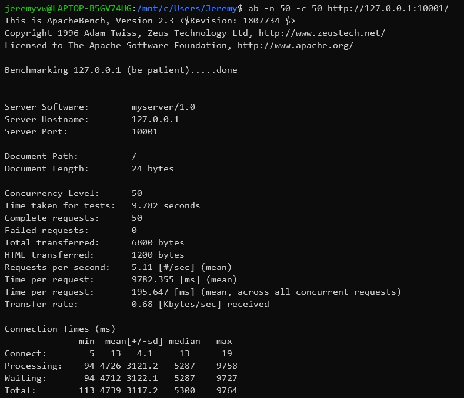

## Hasil test apache-benchmark 100 request

### Concurrency 1

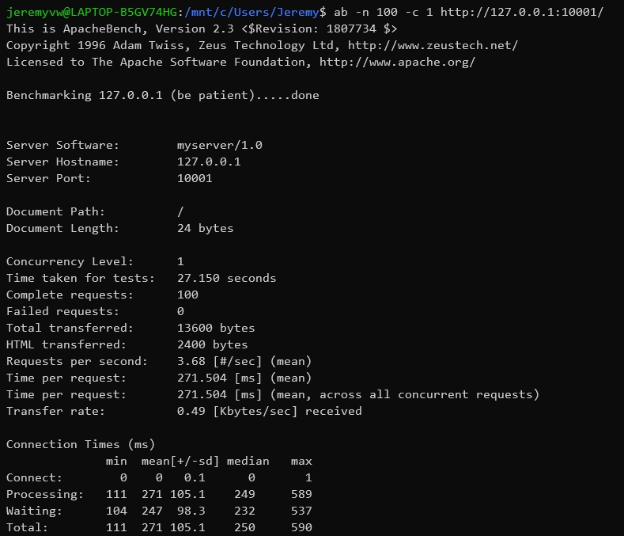
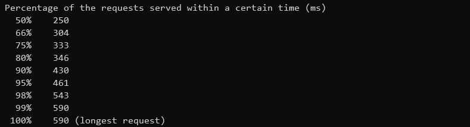

### Concurrency 10

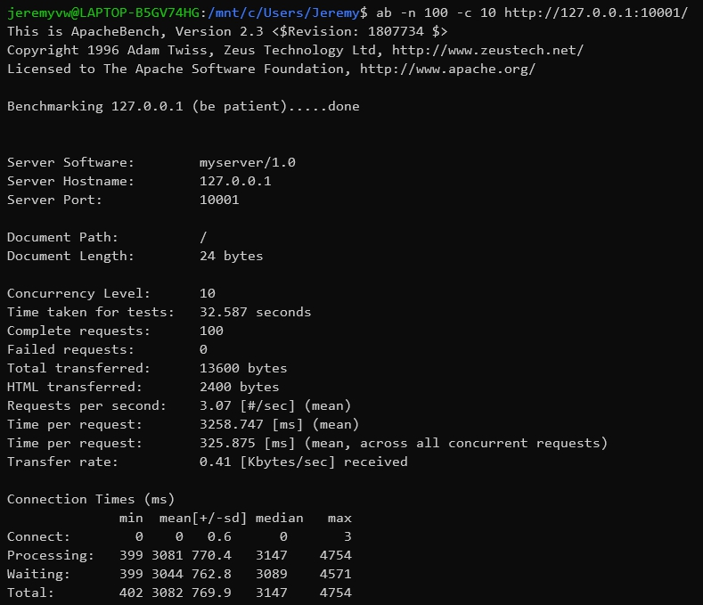

### Concurrency 50

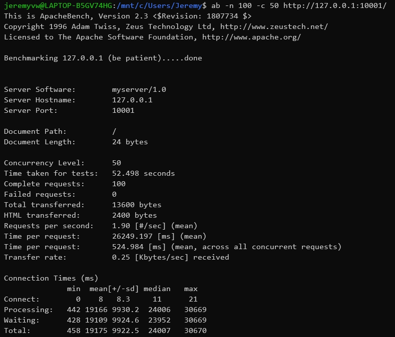
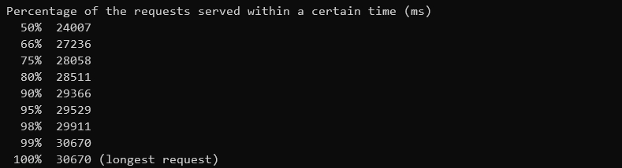

### Concurrency 100

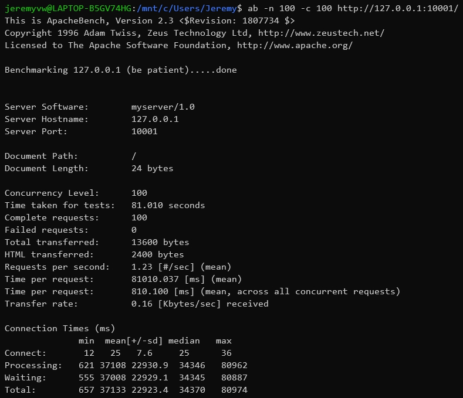
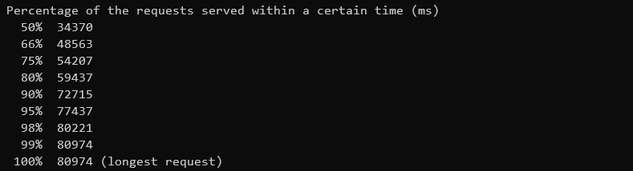
