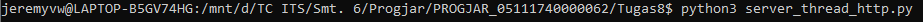
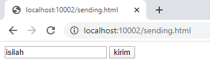
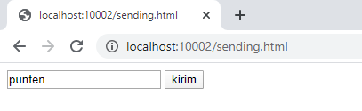
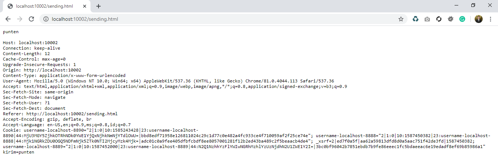
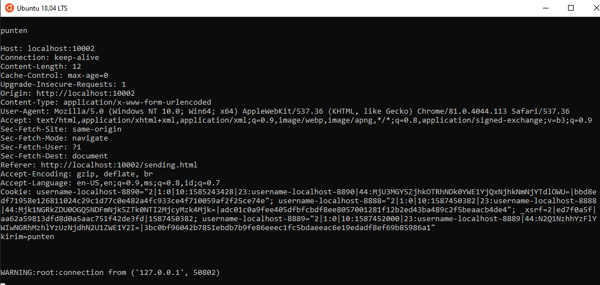

# Tugas 8

Menjalankan server_thread_http.py pada port 10002 terlebih dahulu 

Membuka browser pada alamat 'localhost:10002/sending.html'

Mengganti value pada textfield menjadi 'punten'

Balasan server pada browser

Balasan pada server 

