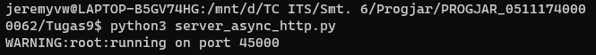
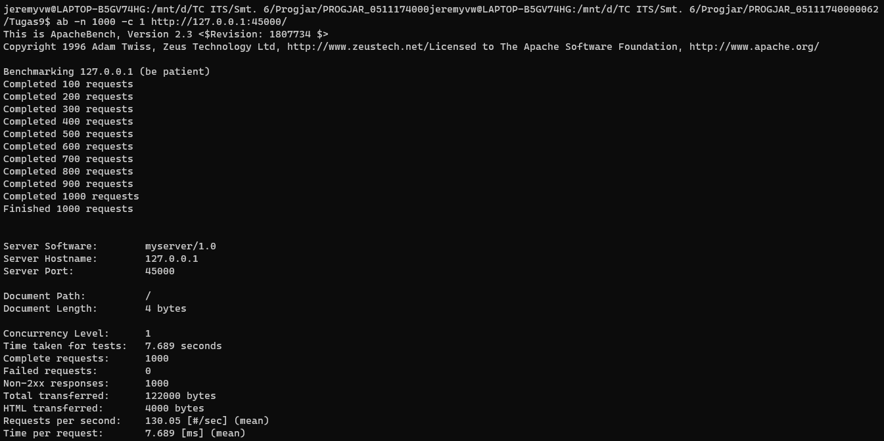
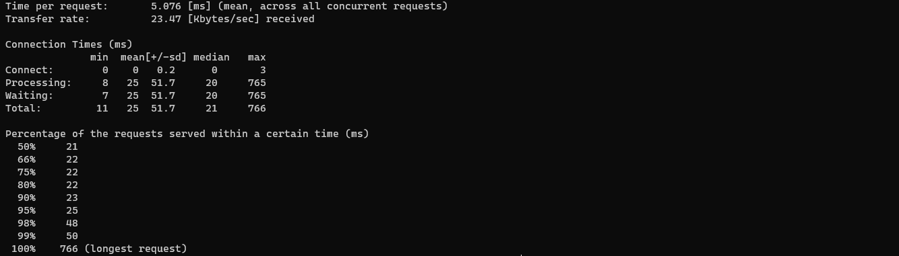
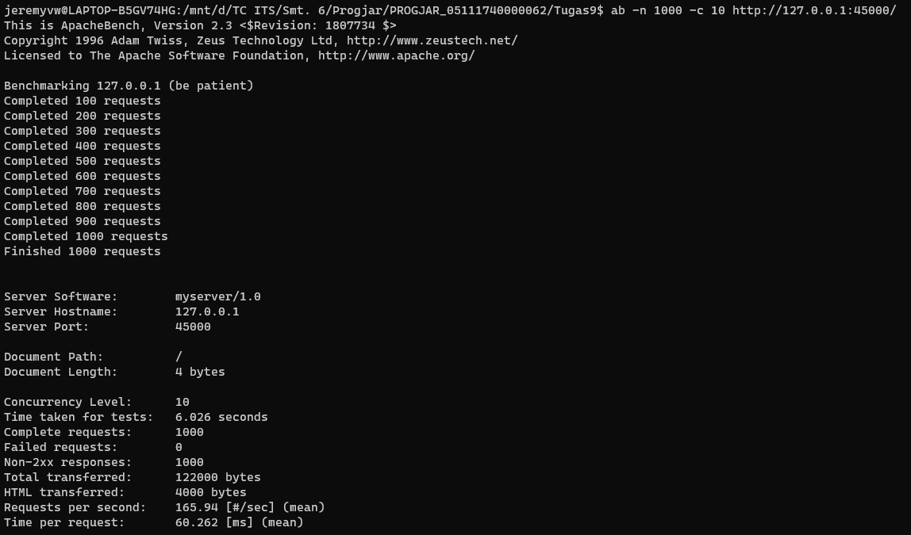
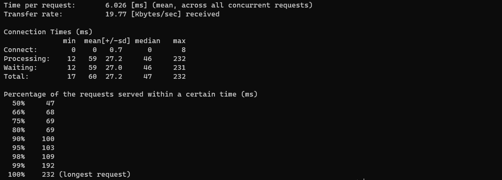
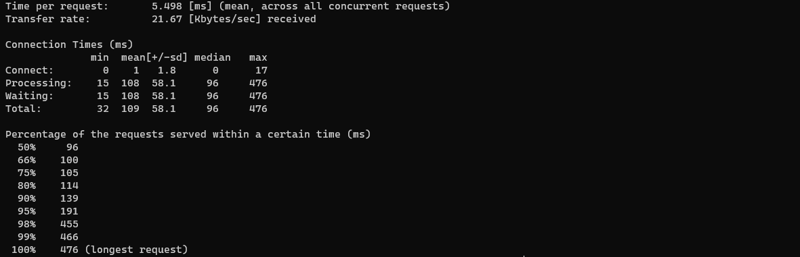
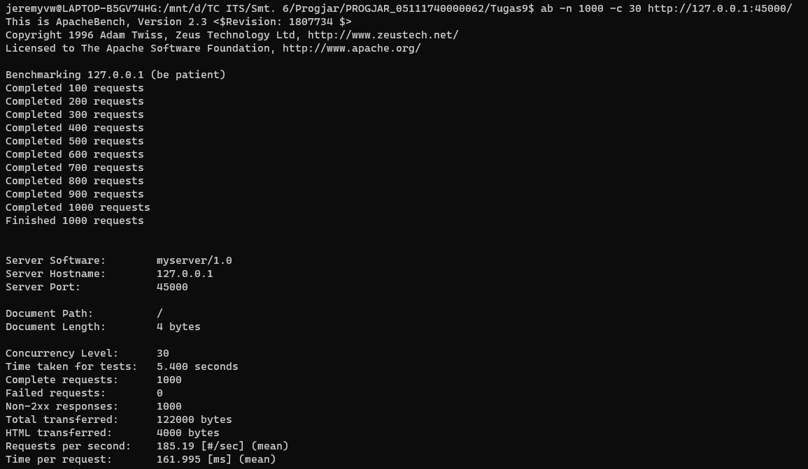
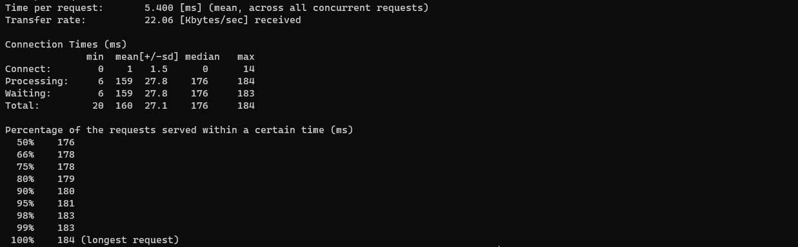
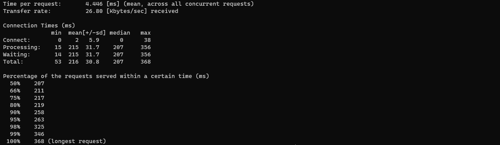
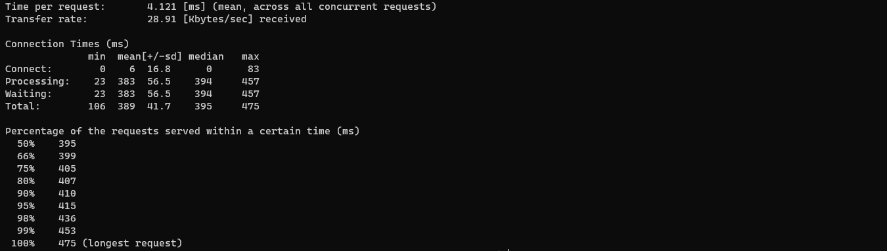

# Tugas 9

## Stress Test Apache Benchmark 1000 Request

## Asynchronous Server

### Concurrency 1

### Concurrency 5

### Concurrency 10

### Concurrency 20

### Concurrency 30

### Concurrency 50

### Concurrency 100

## Asynchronous Server

